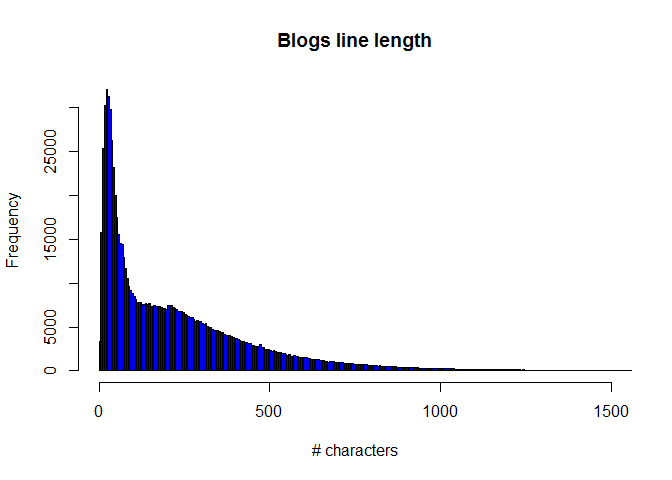
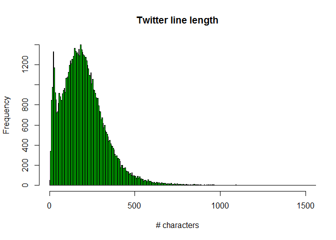
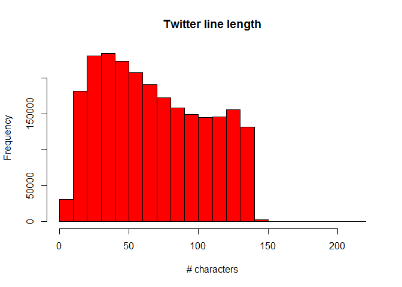

# Data Science Capstone: Milestone 1
Gene Kaufman  
November 27, 2016  
## Introduction
In this first milestone for the Data Science Capstone project, I've done some exploratory analysis on the data provided from SwiftKey.

### Prep environment
Set some global options

```r
require(knitr)
opts_chunk$set(echo=TRUE, results="asis", warning=FALSE, message=FALSE)
```

Load necessary libraries

```r
library(caret)
library("tm")
```

Some functions to help with loading the data

```r
readDataFile <- function(dataFileName) {
  tmpFile <- readLines(dataFileName)
  tmpFile
}

createDataObject <- function (dataIn) {
  objName <- dataIn;
  objDataName <- gsub('en_US.','data_',objName);
  objDataName <- gsub('.txt','',objDataName);
  objDataName <- paste0(objDataName,'_full');
  if (!exists(objDataName)) {
    TempRDSFile <- paste0(baseDataDir, paste0(objDataName,'.Rds') );

    if (file.exists(TempRDSFile)) {
      tempObj <- readRDS(TempRDSFile)
    } else {
      TempDataFile <- paste0(baseDataDir, dataIn )
      if (file.exists(TempDataFile)) {
        tempObj <- readDataFile(TempDataFile);
        saveRDS(tempObj,file=TempRDSFile);
      } else {
        stop(paste('Error!',TempDataFile,' does not exist!'));
      }
    }
    tempObj;
  }
}
```

Set some variables

```r
baseDataDir <- "data/en_US/";

full_blogs_file <- "en_US.blogs.txt";
full_news_file <-  "en_US.news.txt";
full_twitter_file <-  "en_US.twitter.txt";

full_blogs_infile <- paste0(baseDataDir, full_blogs_file);
full_news_infile <- paste0(baseDataDir, full_news_file);
full_twitter_infile <- paste0(baseDataDir, full_twitter_file);
```

### Loading the data


```r
if (!exists("data_blogs_full")) { data_blogs_full <- createDataObject(full_blogs_file) };
if (!exists("data_news_full")) { data_news_full <- createDataObject(full_news_file) };
if (!exists("data_twitter_full")) { data_twitter_full <- createDataObject(full_twitter_file) };
```

## Basic summaries of the data files

Count number of lines in each file

```r
lineCounts <- c(length(data_blogs_full),
               length(data_news_full),
               length(data_twitter_full));
```

Determine longest line for each file

```r
numCharsB <- lapply(data_blogs_full,nchar);
numCharsN <- lapply(data_news_full,nchar);
numCharsT <- lapply(data_twitter_full,nchar);


longestLines <- c(numCharsB[which.max(numCharsB)],
                  numCharsN[which.max(numCharsN)],
                  numCharsT[which.max(numCharsT)]);
```

Word counts for each file

```r
# wc_file generated by command line utility:
#    wc -w en* > word_counts.txt
wc_file <- paste0(baseDataDir,'word_counts.txt')
wordcountsRaw <- read.csv(wc_file,header=FALSE,sep=' ',stringsAsFactors = FALSE)
names(wordcountsRaw) <- c('ignore','NumWords','DataFile');

wordCounts <- c(wordcountsRaw$NumWords[wordcountsRaw$DataFile==full_blogs_file],
                wordcountsRaw$NumWords[wordcountsRaw$DataFile==full_news_file],
                wordcountsRaw$NumWords[wordcountsRaw$DataFile==full_twitter_file]);
```
## Summary table

```r
summ_table<- data.frame(c(full_blogs_file, full_news_file,full_twitter_file),lineCounts,as.array(longestLines),wordCounts)
colnames(summ_table) <- c('File','LineCounts','LongestLine','WordCounts')
```


```r
#knitr::kable(summ_table)
summ_table;
```

```
##                File LineCounts LongestLine WordCounts
## 1   en_US.blogs.txt     899288       40835   37334114
## 2    en_US.news.txt      77259        5760   34365936
## 3 en_US.twitter.txt    2360148         213   30359852
```

## Histogram Charts

```r
hist(unlist(numCharsB),main = "Blogs line length",xlab = "# characters",col = "blue",xlim = c(0,1500),breaks=10000)
```

<!-- -->

```r
hist(unlist(numCharsN),main = "Twitter line length",xlab = "# characters",col = "green",xlim = c(0,1500),breaks=1000)
```

<!-- -->

```r
hist(unlist(numCharsT),main = "Twitter line length",xlab = "# characters",col = "red")
```

<!-- -->

## Conclusions
These are obviously some big files, and my exploratory efforts to convert each entire file to a **Corpus** and then to a **TermDefinitionMatrix** exceeded my computer's resources (for instance - the *data_blogs_full* file complained of needing over 3TB to do the operation!). Going forward, I'll be taking samples of each file (10% or 15%), using the *tm* package to build TermDefinitionMatrices comprised of bigrams and trigrams. I'll then use these TDM's in my Shiny app for the text prediction.
